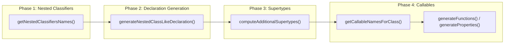
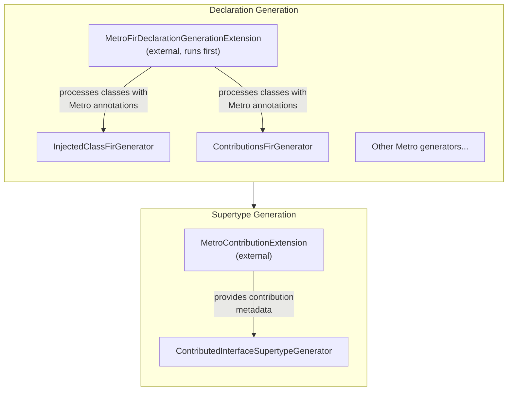

# Metro Compiler Extension API

🚨 This is not a stable API nor should you rely on it! It will break often! Do not file issues about it, no guarantees are made!

Metro provides extension points for third-party code generators to integrate with its pipeline. This allows external tools to generate code that Metro's native generators can process and include in dependency graphs.

## Extension Pipeline Overview

Metro's compiler plugin operates in two phases: **FIR** (Frontend Intermediate Representation) for analysis and declaration generation, and **IR** (Intermediate Representation) for code generation. External extensions plug into the FIR phase.

The extension APIs in Metro are purely for the FIR phase.

### FIR Callback Flow

Each FIR extension receives callbacks in phases. All registered extensions receive each phase's callbacks before moving to the next phase:



### Metro Extension Pipeline

External extensions run **before** Metro's native generators within each phase, allowing generated code to be processed by Metro:



## Extension Points

### MetroFirDeclarationGenerationExtension

Use this extension to generate FIR declarations (classes, functions, properties) that Metro's native generators can then process. External extensions run **before** Metro's native generators.

This API is similar to `FirDeclarationGenerationExtension`, but has a `ServiceLoader` API to be loaded by Metro at compile-time and handles all its callbacks.

### MetroContributionExtension

Use this extension to provide contribution metadata directly to Metro's graph merging infrastructure. This is necessary because Metro's predicate-based provider only sees source declarations, not generated ones.

**Use cases:**
- Provide contribution metadata for classes generated by `MetroFirDeclarationGenerationExtension`
- Enable generated `@Contributes*` classes to be merged into dependency graphs

## Writing an Extension

### Step 1: Create the FIR Declaration Extension

```kotlin
class MyExtension(session: FirSession) : MetroFirDeclarationGenerationExtension(session) {

    private val predicate = LookupPredicate.BuilderContext.annotated(MY_ANNOTATION_FQ_NAME)

    override fun FirDeclarationPredicateRegistrar.registerPredicates() {
        register(predicate)
    }

    override fun getNestedClassifiersNames(
        classSymbol: FirClassSymbol<*>,
        context: NestedClassGenerationContext,
    ): Set<Name> {
        // Return names of classes you want to generate
        if (!matchesPredicate(classSymbol)) return emptySet()
        return setOf(Name.identifier("GeneratedImpl"))
    }

    override fun generateNestedClassLikeDeclaration(
        owner: FirClassSymbol<*>,
        name: Name,
        context: NestedClassGenerationContext,
    ): FirClassLikeSymbol<*>? {
        // Generate the class with Metro annotations
        return createNestedClass(owner, name, MyGeneratedKey) {
            superType(owner.defaultType())
        }.apply {
            // Add @Inject annotation for Metro to process
            val injectAnnotation = buildAnnotation { /* ... */ }
            replaceAnnotations(listOf(injectAnnotation))
        }.symbol
    }

    class Factory : MetroFirDeclarationGenerationExtension.Factory {
        override fun create(
            session: FirSession,
            options: MetroOptions,
        ): MetroFirDeclarationGenerationExtension = MyExtension(session)
    }
}
```

### Step 2: Create the Contribution Extension (if using @Contributes* annotations)

If your generated classes use `@Contributes*` and contribute to a `@DependencyGraph`, you need a `MetroContributionExtension` to provide contribution metadata to supertype merging:

```kotlin
class MyContributionExtension(private val session: FirSession) : MetroContributionExtension {

    override fun FirDeclarationPredicateRegistrar.registerPredicates() {
        register(predicate)
    }

    override fun getContributions(scopeClassId: ClassId): List<Contribution> {
        // Find your generated classes and return their contributions
        return matchingClasses.mapNotNull { parentSymbol ->
            val generatedClassId = parentSymbol.classId.createNestedClassId(GENERATED_NAME)

            // Use MetroContributions API to compute the MetroContribution ClassId
            val metroContributionClassId = MetroContributions
                .metroContributionClassId(generatedClassId, scopeClassId)

            val metroContributionSymbol = session.symbolProvider
                .getClassLikeSymbolByClassId(metroContributionClassId)
                as? FirRegularClassSymbol ?: return@mapNotNull null

            Contribution(
                supertype = metroContributionSymbol.defaultType(),
                replaces = emptyList(),
                originClassId = generatedClassId,
            )
        }
    }

    class Factory : MetroContributionExtension.Factory {
        override fun create(
            session: FirSession,
            options: MetroOptions,
        ): MetroContributionExtension = MyContributionExtension(session)
    }
}
```

Note that you don't need to do this if you only contribute these to a `@GraphExtension`.

### Step 3: Register via ServiceLoader

Create service files in `META-INF/services/`:

**`META-INF/services/dev.zacsweers.metro.compiler.api.fir.MetroFirDeclarationGenerationExtension$Factory`**
```
com.example.MyExtension$Factory
```

**`META-INF/services/dev.zacsweers.metro.compiler.api.fir.MetroContributionExtension$Factory`**
```
com.example.MyContributionExtension$Factory
```

### Step 4: Implement IR Transformation (if needed)

If your FIR extension generates class stubs that need implementation (e.g., constructors with bodies), you'll also need an IR transformer. This is outside the scope of Metro's extension API - you'll need to register your own `IrGenerationExtension` with the Kotlin compiler.

## Utility APIs

### MetroContributions

Helper object for computing `MetroContribution` class IDs for supertype merging:

```kotlin
// Compute the full ClassId of the MetroContribution nested class
val contributionClassId = MetroContributions.metroContributionClassId(
    contributingClassId = myGeneratedClass,
    scopeClassId = appScopeClassId,
)

// Compute just the Name of the contribution class for a scope
val contributionName = MetroContributions.metroContributionName(scopeClassId)
```

## Requirements and Limitations

1. **Extension ordering**: External extensions run before Metro's native generators. This allows generated code to be picked up by Metro.

2. **Predicate registration**: Always register predicates for the source declarations your extension cares about.

3. **IR implementation**: FIR extensions only generate declaration stubs. If your generated classes need method bodies, you must also implement an IR extension.

4. **Contribution metadata**: The predicate-based provider only sees source declarations. If your generated classes use `@ContributesBinding`, you must also implement `MetroContributionExtension` to provide contribution metadata.

5. **Scope matching**: Contributions are matched by scope. Ensure your `getContributions()` implementation correctly filters by the requested `scopeClassId`.
