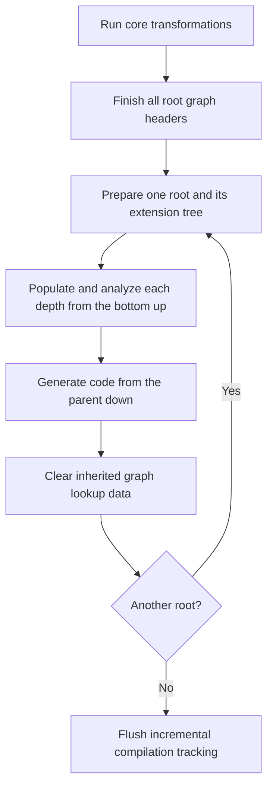
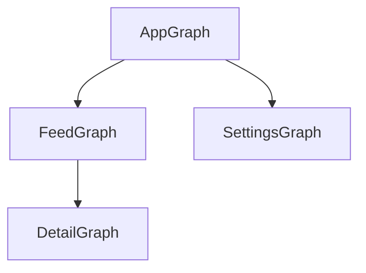
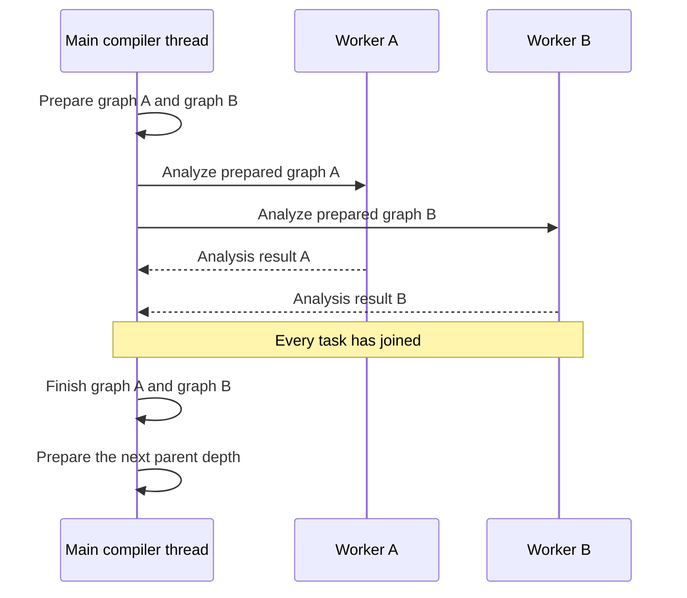

# Parallel Metro Compiler

Metro can analyze several dependency graphs in parallel during its IR pass. Compiler lookups, binding resolution, and code generation stay on the main compiler thread. Workers analyze graph data prepared by that thread.

The main compiler thread is the thread running `MetroIrPipeline` for the current IR fragment.

The `parallel-threads` compiler option controls the pool size. Its default is `0`, which runs analysis inline. Both modes use the same preparation and finishing steps. This option only affects compiler work.

## The pipeline

[`MetroIrPipeline`](../../compiler/src/main/kotlin/dev/zacsweers/metro/compiler/ir/MetroIrPipeline.kt) runs core transformations first. These collect source contributions and generate reusable declarations such as factories and members injectors.

The pipeline then finishes contribution-supertype merges for every regular root graph. An earlier graph can include a later graph. Its hierarchy lookups need to see the later graph's completed supertypes.

Root graphs are processed one at a time. Each root owns a tree of graph extensions.



The diagram shows the successful path. Root cleanup also runs after a failure.

`Lockable.lock()` marks the end of source collection. It's a boolean phase guard. It prevents later structural additions through guarded APIs. Lookup caches can still grow during graph processing on the main compiler thread.

## Preparing the extension tree

[`DependencyGraphTransformer.prepareDependencyGraph`](../../compiler/src/main/kotlin/dev/zacsweers/metro/compiler/ir/transformers/DependencyGraphTransformer.kt) walks the complete extension tree on the main compiler thread. It creates graph nodes, implementation classes, creator functions, and initial binding graphs. This includes grandchildren and deeper extensions.

Creating an extension implementation changes the parent's IR declarations. Those changes must finish before another operation reads the declarations. External factories and contributions can also be loaded during preparation.

This first walk establishes the tree's structure. Each node retains a preparation callback for the remaining binding resolution. The scheduler calls that callback after the node's children have finished analysis.

## Why children finish first

Consider this graph tree:



Suppose `AppGraph` owns an app-scoped `Database`. `DetailGraph` exposes a `Repository` that needs it. `AppGraph` has no accessor for `Database`.

Resolving the child discovers that the parent must supply `Database`. That request becomes an extra root to keep in the parent graph. The parent must receive the request before it decides which bindings are reachable.

The analysis order for this tree is:

1. Prepare, analyze, and finish `DetailGraph`.
2. Prepare `FeedGraph` and `SettingsGraph`. Analyze them in parallel. Finish both.
3. Prepare, analyze, and finish `AppGraph`.

Each batch contains graphs at the same depth. Cousins can share a batch too. Every child finishes before its parent enters a batch.

Each child has a `UsedKeyCollector` for its parent requests. The parent merges those requests before populating its own graph. It also reserves the contextual keys needed by generated parent properties.

`ParentContextSnapshot` captures available keys and their ownership. It retains ancestor readers and suspend-binding callbacks. Those callbacks can perform binding lookups. Snapshot access therefore stays on the main compiler thread.

Parent suspend analysis can populate bindings before the parent's own preparation callback runs. Its cached answers track the parent's binding generation. Adding a binding invalidates answers that depended on the earlier graph state.

## One batch

[`analyzeGraphTree`](../../compiler/src/main/kotlin/dev/zacsweers/metro/compiler/ir/transformers/DependencyGraphTransformer.kt) completes three steps for every depth:



Worker completion order can vary. Results are collected in the batch's input order. Finishing uses that same order.

A batch with one graph runs inline. Disabling parallelism also runs all analysis inline. The phase boundaries stay the same.

### Prepare

[`MutableBindingGraph.prepareSeal`](../../metro-common/src/main/kotlin/dev/zacsweers/metro/compiler/graph/BindingGraph.kt) uses the existing binding work queue to resolve requested dependencies. It reports missing bindings and seals the graph against further additions.

Preparation builds sorted adjacency and selects the roots used by analysis. These include explicit accessors and keys kept for children. Disabling unused-binding shrinking also keeps every populated binding.

Preparation captures the dependency facts needed for cycle analysis. Reading a binding's dependencies can trigger compiler-backed lazy work. Workers must receive those facts fully prepared.

### Analyze

[`PreparedGraphSeal.analyze`](../../metro-common/src/main/kotlin/dev/zacsweers/metro/compiler/graph/PreparedGraphSeal.kt) computes reachability, topological order, and cycle paths. It selects the bindings that need deferred initialization. A hard cycle is recorded for later reporting.

This phase reads the prepared adjacency and deferral information. Its traversal stacks, indexes, and result collections belong to that analysis call. Workers also emit trace spans and run cancellation checks.

The keys are still [`IrTypeKey`](../../compiler/src/main/kotlin/dev/zacsweers/metro/compiler/ir/IrTypeKey.kt) objects. They cache their hash and render string in compact fields. Workers can compute the same value more than once before seeing a cached result. These computations are safe to repeat because they only read prepared declarations. Rendering builds a local string. Qualifier identity uses the shared `memoize` helper and is reached during normal binding-map lookups.

### Finish

`PreparedGraphSeal.finish` runs cycle callbacks and reports any hard cycle on the main compiler thread. It validates reachable bindings and assigns binding indices.

`IrBindingGraph` then finishes its IR-specific validation and reporting. It computes generation data such as shard assignments. It also releases the graph's binding lookup state.

The scheduler uses the finished child results to determine the next parent batch's roots. Compiler caches can grow again during that batch's preparation. All analysis tasks from the previous batch have already joined.

## Capturing deferrals

Adjacency stores one edge per pair of binding keys. Several requests can share that edge:

```kotlin
@Inject class Consumer(
  val value: Value,
  val later: Provider<Value>,
)
```

The edge from `Consumer` to `Value` is eager because the constructor needs `Value` immediately. Request order doesn't change that result.

Preparation records explicitly deferrable targets while building adjacency. It removes a target if the same binding also requests it eagerly. Bindings that are implicitly deferrable are recorded separately.

An all-eager source needs one dependency scan during adjacency construction. It doesn't allocate a per-source deferral set. A source with deferred requests needs a second scan to remove eager duplicates. The retained snapshot only stores effective deferred targets and implicitly deferrable bindings.

These bounds describe snapshot construction. Binding discovery and graph sorting have their own costs. The [performance notes](performance.md#strongly-connected-components) cover the cycle algorithm in more detail.

## Cache ownership

The pipeline owns compiler-facing cache reads and writes. Prepared analysis data stays read-only until the batch has joined. Shared caches can be populated again between batches.

| State | Owner | Lifetime |
| --- | --- | --- |
| Contribution lookups, container closures, and regular graph nodes | Main compiler thread | Reused across roots in the IR run |
| Cached constructor-injected and assisted-factory bindings | `BindingLookupCache` | Reused across roots in the IR run |
| Unfiltered inherited parent graph data | `BindingLookupCache` | Cleared after each root in `processGraph`'s `finally` block |
| Cached type remappers | One graph's `BindingLookup` | Cleared with that lookup |
| Parent requests | One child's `UsedKeyCollector` | Merged before the parent populates its bindings |
| Traversal stacks and cycle indexes | One analysis call | Temporary analysis state |

The long-lived graph and contribution caches use scatter collections for their compact storage. Temporary traversal state can use ordinary maps and sets.

Remappers cache substitutions for a source class and a concrete type. For example, separate child graphs can request `Bindings<String>` and `Bindings<Int>`. Each graph's lookup owns the mutable remappers it reuses. `deepRemapperFor` also supports callers that own a remapper directly.

Regular graph nodes can be reused by class ID. Generated extension nodes depend on their parent tree. They stay outside the regular node cache. Reconstructing those nodes also preserves the ancestor walk used to detect extension cycles.

External declaration lookup remains lazy. [`MetroDeclarations`](../../compiler/src/main/kotlin/dev/zacsweers/metro/compiler/ir/MetroDeclarations.kt) can load factories and members injectors from dependencies. Its lookup methods must stay on the main compiler thread.

Existing tracing, diagnostic, and incremental-compilation infrastructure still has its own synchronization. The graph schedule doesn't require a context-wide cache lock.

## Generating code

Code generation starts after the root's whole tree has finished validation. It runs on the main compiler thread from the parent down.

The parent must create its binding properties before a child can reference them. A child's parent-context token is resolved against those completed properties. Map and provider wrappers must match the contextual key used when the property was stored.

The two orders serve different dependencies:

| Work | Order | Reason |
| --- | --- | --- |
| Binding population and analysis | Children before parents | Children discover parent bindings that must be kept |
| Graph code generation | Parents before children | Children reference properties generated on their parents |

## Failures and cancellation

[`parallelMap`](../../compiler/src/main/kotlin/dev/zacsweers/metro/compiler/collectionUtil.kt) joins every submitted task before returning or throwing. The first failure in input order is rethrown. Distinct later failures are attached as suppressed exceptions.

A failing task doesn't immediately cancel the other tasks. They must finish or observe cancellation through their checks. The pipeline can't resume compiler lookups while an earlier batch is still running.

A hard binding cycle is returned as analysis data. Finishing turns it into a compiler diagnostic. Other analysis failures propagate after the batch has drained.

`processGraph` handles `ExitProcessingException` after the error has been reported. It clears inherited graph data in `finally`. Unexpected exceptions propagate out of the pipeline.

Finishing can stop early after an error. The join guarantee applies to worker completion. It doesn't promise a diagnostic from every remaining graph.

## Shared code and future changes

The phase API lives in `metro-common`. It uses generic graph types and has no dependency on IR classes. `MutableBindingGraph.prepareSeal()` is the entry point for both compiler and IDE callers. A caller that runs everything inline can use the three phases directly:

```kotlin
val prepared = graph.prepareSeal(roots = roots)
val analysis = prepared.analyze()
val topology = prepared.finish(analysis)
```

The IR adapter owns compiler-specific preparation and finishing. Key hashing and comparison must support concurrent reads during analysis.

Adding work to `analyze()` requires checking every value and callback it touches. A read can populate a lazy cache. A collection can contain a compiler-backed object. New work must use prepared values or analysis-local state. Trace and cancellation callbacks must remain safe on workers.

Parallel work is limited by the width of each tree level. A chain of extensions has one graph per level and gets no parallel analysis from this scheduler. A wide level can use more workers. Binding resolution, IR validation, and generation stay on the main compiler thread.

Compile-time performance needs measurement on representative graphs. This design doesn't establish a speedup by itself. Compare preparation, analysis, finishing, allocation, and total compile time when changing the boundary.
