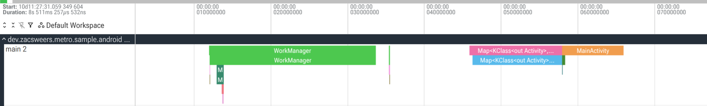

# Performance

Metro strives to be a performant solution with minimal overhead at build-time and generating fast, efficient code at runtime.

## Benchmarks

To benchmark against anvil-ksp + dagger-ksp, anvil-ksp + dagger-kapt, and kotlin-inject-anvil + kotlin-inject, there is a [benchmark](https://github.com/ZacSweers/metro/tree/main/benchmark) directory with a generator script. There are more details in its README, but in short it generates a nontrivial multi-module project (default is 500 modules but is configurable) and benchmarks with gradle-profiler.

The below sections describe the two scenarios Metro's benchmarks run against using this project generation.

**Modes**

- `Metro`: Purely running metro
- `Dagger (KSP)`: Running dagger-ksp with anvil-ksp for contribution merging.
- `Dagger (KAPT)`: Running dagger-kapt with anvil-ksp for contribution merging.
- `Kotlin-Inject`: Running kotlin-inject with kotlin-inject-anvil for contribution merging.

### Build Performance

Metro's compiler plugin is designed to be _fast_. Running as a compiler plugin allows it to:

- Avoid generating new sources that need to be compiled
- Avoid running KSP/KAPT
- Generate IR that lowers directly into target platforms
- Hook directly into kotlinc's IC APIs.

**In a straightforward migration, it improves ABI-changing build performance by 80–85%.**

#### Methodology

This benchmark uses [gradle-profiler](https://github.com/gradle/gradle-profiler) to benchmark build performance using different tools.

!!! tip "Summary"
    Results as of Metro `0.8.3`, Anvil-KSP `0.5.1`, Dagger `2.57.2`, and Kotlin-Inject `0.8.0` with kotlin-inject-anvil `0.1.6` are as follows.

    _(Median times in seconds)_

    |                      | Metro  | Dagger (KSP)   | Dagger (KAPT) | Kotlin-Inject |
    |----------------------|--------|----------------|---------------|---------------|
    | **ABI**              | 17.5s  | 119.6s (+584%) | 93.2s (+433%) | 32.3s (+85%)  |
    | **Non-ABI**          | 11.6s  | 13.8s (+20%)   | 23.2s (+100%) | 11.3s (-2%)   |
    | **Graph processing** | 22.6s  | 88.1s (+290%)  | 26.0s (+15%)  | 28.3s (+25%)  |

    View the [full interactive benchmark report](benchmark_assets/build-benchmark-report.html) for detailed results including environment information.

##### ABI Change

This benchmark makes ABI-breaking source changes in a lower level module. This is where Metro shines the most.


##### Non-ABI Change

This benchmark makes non-ABI-breaking source changes in a lower level module. The differences are less significant here as KSP is quite good at compilation avoidance now too. The outlier here is KAPT, which still has to run stub gen + apt and cannot fully avoid it.


##### Raw Graph/Component Processing

This benchmark reruns the top-level merging graph/component where all the downstream contributions are merged. This also builds the full dependency graph and any contributed graph extensions/subcomponents.

Metro again shines here. Dagger (KSP) seems to have a bottleneck that disproportionately affects it here too.


### Runtime Performance

Metro's compiler generates Dagger-style factory classes for every injection site. The same factory classes are reused across modules and downstream builds, so there's no duplicated glue code or runtime discovery cost.

Because the full dependency graph is wired at compile-time, each binding is accessed through a direct provider field reference or direct invocation in the generated code. No reflection, no hashmap lookups, no runtime service locator hops, etc.

#### Methodology

To measure and compare runtime performance, Metro benchmarks graph initialization time across different DI frameworks. These benchmarks measure the time to create and initialize a dependency graph with 500 modules' worth of bindings.

!!! note "Interactive Report"
    View the [full interactive benchmark report](benchmark_assets/startup-benchmark-report.html) for detailed results including environment information.

#### JVM Startup

These benchmarks run with JMH.

On the JVM, Metro, Dagger (KSP), and Dagger (KAPT) all perform nearly identically since they generate similar factory-based code. kotlin-inject is slightly slower due to its different code generation approach.


#### JVM Startup (R8 Minified)

These benchmarks run with JMH on an R8-minified jar of the same built project.

With R8 minification enabled, Metro shows a slight edge. The benefits of compile-time wiring become more apparent as R8 can further optimize the generated code.


#### Android Graph Init

On Android, the differences become more pronounced. Metro and Dagger perform similarly well, while kotlin-inject shows a significant performance gap.


## Real-World Results

Below are some results from real-world projects, shared with the developers' permission.

!!! note "Square"
    Square wrote a blog post about their migration to Metro: [Metro Migration at Square Android](https://engineering.block.xyz/blog/metro-migration-at-square-android)

    > How Square Android migrated its monorepo from Dagger 2 and Anvil to Metro over nine months and saved thousands of hours of build time.

!!! note "Cash App"
    Cash App wrote a blog post about their migration to Metro: [Cash App Moves to Metro](https://code.cash.app/cash-android-moves-to-metro)

    > According to our benchmarks, by migrating to Metro and K2 we managed to improve clean build speeds by over 16% and incremental build speeds by almost 60%!

!!! note "Gabriel Ittner from Freeletics"
    I've got Metro working on our code base now using the Kotlin 2.2.0 preview
    
    Background numbers
    
    - 551 modules total
    - 105 modules using Anvil KSP ➡️ migrated to pure Metro
    - 154 modules using Anvil KSP + other KSP processor ➡️ Metro + other KSP processor
    - 1 module using Dagger KAPT ➡️ migrated to pure Metro
    
    Build performance
    
    - Clean builds without build cache are 12 percentage points faster
    - Any app module change ~50% faster (this is the one place that had kapt and it's mostly empty other than generating graphs/components)
    - ABI changes in other modules ~ 40% - 55% faster
    - non ABI changes in other modules unchanged or minimally faster

!!! note "Madis Pink from emulator.wtf"
    I got our monorepo migrated over from anvil, it sliced off one third of our Gradle tasks and `./gradlew classes` from clean is ~4x faster

!!! note "Kevin Chiu from BandLab"
    We migrated our main project at BandLab to metro, finally!
    
    Some context about our project:

    - We use Dagger + Anvil KSP
    - 929 modules, 89 of them are running Dagger compiler (KAPT) to process components
    - 7 KSP processors

    | Build                             | Dagger + Anvil KSP | Metro (Δ)              |
    |-----------------------------------|--------------------|------------------------|
    | UiKit ABI change (Incremental)    | 59.7 s             | 26.9 s (55% faster)   |
    | Root ABI change (Incremental)     | 95.7 s             | 48.1 s (49.8% faster) |
    | Root non-ABI change (Incremental) | 70.9 s             | 38.9 s (45.2% faster) |
    | Clean build                       | 327 s              | 288 s (11.7% faster)  |

!!! note "Cyril Mottier from Amo"
    [Ref](https://x.com/cyrilmottier/status/1971562605899546936)

    > We already had incremental compilation in the single-digit seconds range, but I’m still blown away by how much faster it is now that the entire codebase is fully on Metro. 🤯

!!! note "Vinted"
    Vinted adopted metro and reaped significant build time and developer experience improvements: [From Dagger to Metro](https://vinted.engineering/2026/02/12/from-dagger-to-metro/)

    > Metro consolidated all the best practices from other popular frameworks, while leaving out the not-so-best practices on the side, allowed us to enable K2 and immediately experience significant build time improvements, while also unlocking incremental compilation, which means that the builds will be getting even faster

## Scaling to Very Large Graphs

For graphs aggregating thousands of contributions, two opt-in knobs help work around JVM and Kotlin metadata size limits. Both are power-user features and unnecessary for typical graphs.

### `@MergeContributionsInIr`

Annotating a graph with `@MergeContributionsInIr` opts it out of FIR-side contribution-supertype merging. Contributions are still merged into the graph during IR, so runtime behavior is unchanged. The trade-off is that contributions become invisible in the graph's Kotlin metadata:

- Code consuming the graph as an `@Includes` dependency will not see contributed members.
- IDE support will not surface contributed members on the graph type.
- Kotlin/Native ObjC framework export will not include contributed interfaces in the graph's supertype list.

This annotation is `@DelicateMetroApi` and requires explicit opt-in. You should only use this if you have a very specific reason to.

### `merged-supertype-chunk-size`

The `merged-supertype-chunk-size` Metro compiler option groups merged contribution supertypes into synthetic intermediate interfaces of at most N contributions each. This is useful for graphs whose merged supertype list would otherwise exceed the JVM's 65535-byte class signature limit, which the JVM emits whenever at least one supertype is generic.

```kotlin
metro {
  compilerOptions.put("merged-supertype-chunk-size", "200")
}
```

Default `0` disables chunking. Each chunk holds up to N contributions plus their promoted parent interfaces, so the chunk count tracks the contribution count rather than the raw supertype count. Most useful paired with `@MergeContributionsInIr` for the largest graphs.

### Shortening generated member names

For very large graphs, the descriptive declaration names Metro generates on can contribute a measurable amount of bytecode/string-table size. The `member-naming-strategy` compiler option swaps them for a smaller vocabulary.

```kotlin
metro {
  compilerOptions.put("member-naming-strategy", "TYPED")
}
```

Three values are accepted:

- **`DESCRIPTIVE`** (default): names derived from binding types and parameters (e.g. `httpClientProvider`, `databaseProvider`).
- **`TYPED`**: short kinded prefixes for graph supplemental and graph-as-shard binding properties (`provider`, `provider2`, ...; `instance`, `instance2`, ...; `factory`, `factory2`, ...).
- **`MINIMAL`**: single short vocabulary; every kind collapses to `provider` (e.g. `provider`, `provider2`, `provider3`, ...).

When sharding is active and a graph splits into multiple shard classes, each shard's binding properties always collapse to `MINIMAL` regardless of the chosen strategy (so long as it is not `DESCRIPTIVE`), and each shard uses its own name allocator. The same name string (`provider`, `provider2`, ...) therefore recurs across shard classes.

#### When this matters

- Graph classes with thousands of fields shrink because each field name in the constant pool's UTF-8 strings is shorter.
- Multi-shard graphs additionally benefit from cross-class deduplication since the same short strings recur across shard classes.
- Factory (and similar) classes benefit similarly via cross-class dedup in DEX, where the small fixed vocabulary recurs across thousands of generated factory classes.

#### When this does not matter

**Builds shrunk by R8/ProGuard:** Private generated field names are renamed/inlined/etc by the shrinker regardless of what Metro emits. There is effectively no artifact-size difference between `DESCRIPTIVE`, `TYPED`, and `MINIMAL` once R8 has run. The option is most useful for pipelines that ship un-minified bytecode (pure JVM server apps, distributed library AARs at author dev time, debug Android builds).

Default is `DESCRIPTIVE` so generated code stays readable. Opt in only if you have a specific size constraint that benefits.

## Tracing

### Compiler tracing

If you want to investigate the performance of Metro's compiler pipeline, you can enable tracing in the Gradle DSL.

```kotlin
metro {
  traceDestination.set(layout.buildDirectory.dir("metro/trace"))
}
```

This will output one or more Perfetto trace files after the compilation that you can then load into https://ui.perfetto.dev.

Filenames follow the pattern `<id>-<phase>-<moduleName>.perfetto-trace`, where `<id>` is a `yyMMdd-HHmmss` timestamp shared across every file produced by the same compilation, `<phase>` is `fir` or `ir`, and `<moduleName>` identifies the FIR session or IR module fragment. KMP source-set hierarchies and multi-fragment IR each produce their own files. Load whichever file corresponds to the phase you want to inspect.

Note that these traces probably do require a bit of familiarity with the Metro compiler internals.

!!! warning

    Note that file option inputs like `traceDestination` are _not_ tracked as inputs to the kotlin compilation, so you should run your target kotlin compilation task with `--rerun` (not `--rerun-tasks`!) to ensure it it's not cached.

### Runtime tracing

Metro can also emit traces from generated graph code. For example, this is useful when you want to see which bindings are created or invoked during app startup or another measured runtime path.

!!! warning "Experimental"

    Runtime tracing is experimental. It currently targets JVM/Android graph code and integrates with AndroidX Tracing 2.x, which is still actively being developed. Expect the generated metadata and runtime helper APIs to change as AndroidX Tracing 2.x evolves.

Enable it in the Gradle DSL:

```kotlin
metro {
  enableRuntimeTracing.set(true)
}
```

When automatic runtime dependencies are enabled, Metro adds the JVM-only `metro-trace` helper artifact to JVM/Android JVM compilations.

Each root graph should take an AndroidX `Tracer` as a graph input. Metro uses this input while initializing the graph's trace context, before ordinary binding traces can be emitted:

```kotlin
@DependencyGraph
interface AppGraph {
  @DependencyGraph.Factory
  interface Factory {
    fun create(@Provides tracer: Tracer): AppGraph
  }
}
```

On Android, prefer owning a single app-level `TraceDriver` and passing its tracer into the root graph from `Application.onCreate()`:

```kotlin
class MyApplication : Application(), AbstractTraceDriver.Factory {
  private val sink = TraceSink(context = this)
  // isCategoryEnabled = { true } here means that Tracing is unconditionally enabled.
  // This makes local iteration fast and easy. In production, you might want to use another explicit signal
  // (or UI affordance) to turn on in-process tracing.
  private val driver = TraceDriver(context = this, sink = sink, isCategoryEnabled = { true })

  lateinit var appGraph: AppGraph
    private set

  @OptIn(DelicateTracingApi::class)
  override fun onCreate() {
    super.onCreate()
    Tracer.setGlobalTracer(driver.tracer)
    appGraph = createGraphFactory<AppGraph.Factory>().create(driver.tracer)
  }

  override fun create(): AbstractTraceDriver = driver
}
```

`AbstractTraceDriver.Factory` lets AndroidX's profiler tooling discover the same driver that Metro uses. `Tracer.setGlobalTracer(...)` also makes the tracer available to other libraries using AndroidX's global tracer discovery. Also, disable the default `TraceDriver` initialization hook (`androidx.tracing.profiler.ConnectedProfilerTracingInitializer`) so it does not eagerly set `Tracer.setGlobalTracer(...)`.

```xml
<!-- Use MyApplications's TraceDriver so sample traces and profiler broadcasts share one sink and is always enabled. -->
<meta-data
    android:name="androidx.tracing.profiler.ConnectedProfilerTracingInitializer"
    android:value="androidx.startup"
    tools:node="remove" />
```

With AndroidX Tracing 2.0.0-alpha09 and newer, `TraceSink` defers file setup. Graph creation no longer needs to be delayed with `lazy` just to avoid early trace output initialization.

!!! tip "Tracing inside bindings"

    Metro traces the generated binding boundary. If a binding does meaningful work inside that boundary and you want more granular events, inject or depend on `Tracer` like any other binding and use AndroidX Tracing directly from that code.

    ```kotlin
    @Provides
    fun provideDatabase(driver: SqlDriver, tracer: Tracer): AppDatabase =
      tracer.trace(category = "app.database", name = "Open database") {
        AppDatabase(driver)
      }
    ```

Suspend bindings use coroutine-aware trace sections, so their spans remain connected across suspension points and thread changes. Suspend accessors emit the same instant events as other accessors. A scoped suspend binding emits a span only when it computes the value; cache hits emit none. See [Coroutines Support](coroutines.md).

Generated binding spans use the short rendered binding name, including the qualifier when present. Entry-point markers, such as accessors and member injectors, are emitted as instant events named after the implemented graph callable. Requested `MembersInjector<T>` values also emit instant events named like `MembersInjector<T>` when `injectMembers(...)` is called. Metro also attaches string metadata for filtering and grouping:

- `metro.graph`: the graph that owns the binding.
- `metro.graph_path`: the root-to-current graph path, useful for graph extensions.

Binding span metadata:

- `metro.type`: the canonical unqualified type.
- `metro.binding_kind`: the generated binding implementation kind, such as `Provided`, `ConstructorInjected`, or `Multibinding`.

Entry-point instant metadata:

- `metro.callable`: the callable name without the graph prefix, such as `foo` for `AppGraph.foo`.
- `metro.type`: the canonical unqualified requested type.
- `metro.entry_point_kind`: the generated graph entry-point kind, such as `Accessor` or `Member Injector`.

Both binding spans and entry-point instants may also include:

- `metro.contextual_type`: the requested unqualified type, when it differs from `metro.type`, such as `Provider<T>` or `Lazy<T>`.
- `metro.qualifier`: the binding qualifier, when present.

Here is what a trace looks like.



[Here is the link to the sample app](https://github.com/ZacSweers/metro/tree/main/samples/android-app) with the right setup for runtime tracing.

!!! note "Flushing traces"

    The sample app has UI affordance to flush traces manually. However you can also flush traces programmatically by doing something like:
    ```bash
    adb shell am broadcast -a androidx.tracing.profiler.action.FLUSH_TRACES_GET_PATH <targetPackage>/androidx.tracing.profiler.ConnectedProfilerTracingReceiver
    ```
