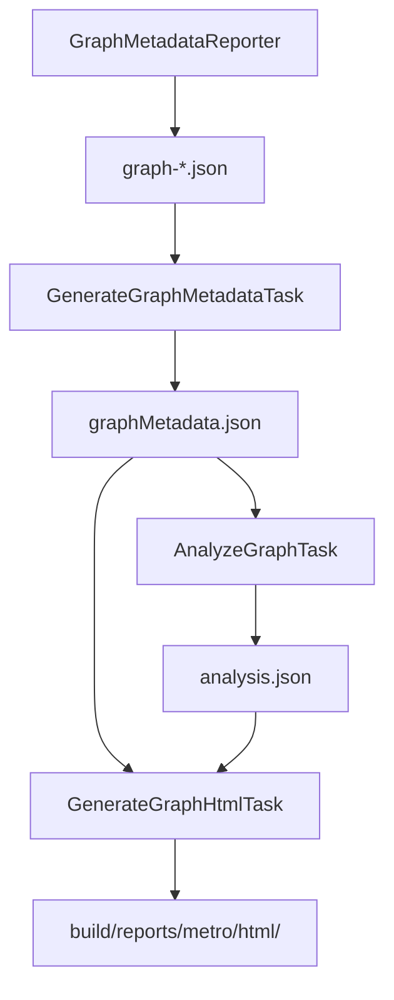

# Metro Graph Analysis & Visualization

This document describes the graph analysis and visualization system for Metro dependency graphs.

## Overview

The system generates self-contained HTML explorers for Metro dependency graphs. A Canvas viewer renders the graph with subway-style lines. HTML controls provide search, navigation, and binding details. Generation has four phases:

1. **Metadata Generation** (Compiler) - The compiler plugin exports graph metadata as JSON during IR transformation
2. **Metadata Aggregation** (Gradle) - Gradle tasks aggregate per-graph JSON files into a single file
3. **Analysis** (Gradle) - Computes graph statistics, paths, and binding metrics
4. **HTML Generation** (Gradle) - Generates interactive HTML visualizations from the metadata and analysis

## Architecture



## Key Files

### Compiler Side
- `compiler/.../ir/graph/GraphMetadataReporter.kt` - Exports binding graph metadata to JSON

### Gradle Plugin Side
- `GraphMetadataModels.kt` - Kotlinx Serialization data classes for JSON parsing
- `artifacts/GenerateGraphMetadataTask.kt` - Aggregates individual graph JSON files
- `AnalyzeGraphTask.kt` - Analyzes the aggregated graph metadata
- `GenerateGraphHtmlTask.kt` - Builds viewer data and embeds the bundled resources into HTML
- `src/main/resources/dev/zacsweers/metro/gradle/analysis/graph-viewer.html` - Viewer controls and page structure
- `src/main/resources/dev/zacsweers/metro/gradle/analysis/graph-viewer.css` - Dark subway-map theme
- `src/main/resources/dev/zacsweers/metro/gradle/analysis/graph-viewer.js` - Canvas rendering, navigation, and inspection
- `GraphAnalyzer.kt` - Analysis utilities (cycle detection, metrics, etc.)

## Data Models

### GraphMetadata
Top-level metadata for a dependency graph:
```kotlin
data class GraphMetadata(
  val graph: String,                    // Fully qualified graph class name
  val scopes: List<String>,             // Scope annotations
  val aggregationScopes: List<String>,  // Aggregation scope class names
  val roots: RootsMetadata?,            // Roots (accessors, injectors)
  val extensions: ExtensionsMetadata?,  // Graph extension information
  val bindings: List<BindingMetadata>,  // All bindings in the graph
)
```

### RootsMetadata
Graph roots (separate from binding dependencies):
```kotlin
data class RootsMetadata(
  val accessors: List<AccessorMetadata>,  // Name, property/function kind, requested key, deferral
  val injectors: List<InjectorMetadata>,  // fun inject(target: Foo)
)
```

### ExtensionsMetadata
Graph extension information:
```kotlin
data class ExtensionsMetadata(
  val accessors: List<ExtensionAccessorMetadata>,         // Extension accessors
  val factoryAccessors: List<ExtensionFactoryAccessorMetadata>,  // Factory accessors
  val factoriesImplemented: List<String>,                 // Factory interfaces this graph implements
)
```

### BindingMetadata
Represents a single binding in the graph:
```kotlin
data class BindingMetadata(
  val key: String,           // Full type key (may include annotations/generics)
  val bindingKind: String,   // ConstructorInjected, Provided, Alias, Multibinding, etc.
  val isScoped: Boolean,
  val dependencies: List<DependencyMetadata>,
  val isSynthetic: Boolean,  // Generated/internal bindings (aliases, contributions)
  // ... other fields
)
```

### DependencyMetadata
Represents a dependency edge:
```kotlin
data class DependencyMetadata(
  val key: String,            // Type key of the dependency
  val hasDefault: Boolean,    // Has a default value
  val wrapperType: String?,   // Wrapper type if wrapped (e.g., "Provider", "Lazy")
) {
  val isDeferrable: Boolean   // Computed: true if wrapperType != null
}
```

### AssistedTargetMetadata
`Assisted` factory bindings expose their target through nested metadata. This has the same structure as `BindingMetadata` plus `assistedParameters`:
```kotlin
data class AssistedTargetMetadata(
  val key: String,                                   // Target type key
  val bindingKind: String,                           // Usually "ConstructorInjected"
  val scope: String? = null,
  val isScoped: Boolean = false,
  val nameHint: String,
  val dependencies: List<DependencyMetadata>,        // Target's actual dependencies
  val origin: String? = null,
  val declaration: String? = null,
  val multibinding: MultibindingMetadata? = null,
  val optionalWrapper: OptionalWrapperMetadata? = null,
  val isSynthetic: Boolean = false,
  val assistedParameters: List<AssistedParameterMetadata>,  // Call-time parameters
)

data class AssistedParameterMetadata(
  val key: String,   // Type key
  val name: String,  // Parameter name
)
```

Assisted-inject targets belong to their factory bindings. The viewer reads their information from `BindingMetadata.assistedTarget`.

Accessors are recorded in the `roots` object. The graph's BoundInstance binding has no accessor dependencies. `BindingGraph` creates edges from the graph to accessor targets for analysis.

## Analysis Result Models

Analysis results are organized by graph in `AnalysisResults.kt`. Each graph's analysis is grouped together in a `GraphAnalysis` object:

```kotlin
// Top-level report containing all graphs
data class FullAnalysisReport(
  val projectPath: String,
  val graphs: List<GraphAnalysis>  // All analysis grouped per-graph
) {
  val graphCount: Int get() = graphs.size  // Computed property
}

// All analysis for a single graph, co-located
data class GraphAnalysis(
  val graphName: String,
  val statistics: GraphStatistics,
  val longestPath: LongestPathResult,
  val dominator: DominatorResult,
  val centrality: CentralityResult,
  val fanAnalysis: FanAnalysisResult,
  val pathsToRoot: PathsToRootResult,
)
```

The parent `GraphAnalysis` stores `graphName` for all its results. Individual result types such as `GraphStatistics` and `LongestPathResult` omit that field.

## Type Key Handling

Type keys can be complex strings with annotations, generics, or wrapper types. Three helper functions handle these:

### `unwrapTypeKey(key: String): String`
Unwraps Provider/Lazy wrappers to find the actual target node:
- `Provider<com.example.Foo>` → `com.example.Foo`
- `Lazy<com.example.Bar>` → `com.example.Bar`

### `extractDisplayName(key: String): String`
Extracts a human-readable short name:
- `kotlin.collections.Set<com.example.Plugin>` → `Set<Plugin>`
- `@annotation.Foo(...) com.example.Bar` → `Bar`
- `com.example.Companion` → `EnclosingClass.Companion`

### `extractPackage(key: String): String`
Extracts the package for filtering:
- `kotlin.collections.Set<com.example.Plugin>` → `com.example` (from type param)
- `@annotation.Foo(...) com.example.Bar` → `com.example` (from actual type)

**Important:** Keys starting with `@` are annotation-qualified types. The format is:
```
@fully.qualified.Annotation("args") actual.type.Name
```
Always strip the annotation prefix before extracting package/display name.

## Viewer Data and Resources

`GraphHtmlRenderer.buildData()` combines graph nodes and typed links with the analysis metrics, longest eager path, compiler configuration, counters, and binding explanations. `generateHtml()` embeds that data and the three `graph-viewer` resources into a single HTML document. The generated page can open directly from disk and does not fetch scripts or styles.

The viewer uses complete type keys as node identities. Keep qualifiers and generic arguments in these keys so bindings with similar names remain distinct. Original keys remain available for inspection and copying.

Binding labels use simple type names and retain nested names such as `Presenter.Factory`. Package qualification distinguishes different types that would otherwise share a label. Bindings of the same type can receive qualifier or source captions. Map labels, binding lists, and connection rows use this naming consistently. Displayed text omits internal multibinding annotations.

`indexGraph()` constructs outgoing and incoming adjacency maps once. It also indexes packages, graph regions, and explanation records by region and binding key. The Connections view, routes, and inspector use these maps.

### Connection Semantics

Dependency links point from a consumer to its dependency. The viewer also includes graph accessors and injector relationships, assisted targets, aliases, multibinding contributions, and default-value nodes when present in the metadata.

| Link field         | Meaning                                                                       |
|--------------------|-------------------------------------------------------------------------------|
| `edgeType`         | Relationship label used for display and filtering                             |
| `wrapperType`      | Recorded wrapper for a deferred dependency                                    |
| `hasDefault`       | Whether the declaration permits a default value                               |
| `presentationOnly` | A visual relationship excluded from traversal and inspector dependency counts |
| `lineStyle`        | Color and line pattern supplied by the renderer                               |

Each supplied bound instance has one square graph-input node. Consumers connect directly to that node. Selecting a graph input highlights its immediate visible consumers. Its **Connections** action starts in the Consumers direction. Graph inputs have no visible route action.

Default-value nodes represent an available default when the recorded dependency has no resolved binding. A default-capable dependency that resolves to a binding keeps its actual dependency relationship.

Graph roots come from `roots.accessors`, `roots.injectors`, and named extension accessor records. The renderer creates a graph container and one root member per record. Accessors connect to resolved bindings. Injectors connect to injected dependencies. The compiler records accessor names, whether each accessor is a property, and injector names. Root nodes show those names with the requested type as supporting text.

Route traversal and layout calculations use the graph container and its membership links. Rendered views omit the container node and its membership lines. Graph names appear near the nodes owned by each graph. The injectable graph instance retains its canonical binding key and has no outgoing root-membership edges. Structural roots are excluded from binding and package counts.

### Bindings and Colors

Package overview colors identify namespace groups. Binding views use the renderer's binding-kind palette in `Colors`. Bindings are circular, graph inputs are square, and scoped bindings have a white border.

**Automatic** direction places supplied inputs on the left graph boundary and named roots on the right. Isolated routes read top to bottom from dependency to consumer. Arrows and animation follow that visual direction. Semantic adjacency remains consumer to dependency.

The container is excluded from node hit testing, labels, route numbering, and dependency animation. An injectable graph instance retains its own binding node.

Dependency lines generally inherit the source binding's color. Accessors, aliases, defaults, and other typed relationships can supply their own styles. Deferred connections use dashed lines. Aliases use dotted lines. The inspector includes relationship labels and wrapper information.

## Browsing and Filtering

The viewer starts in **Overview**. `groupPackages()` groups related packages by namespace with a target of 12 groups. Overview combines connections between the resulting groups. The groups span graphs. Overview omits graph enclosures and graph titles.

Selecting a group shows its member packages and their immediate external connections. Group nodes show full namespace labels and the number of bindings passing the display options. Missing package information is labeled **Unassigned package**.

The selected-binding toolbar places **Connections** and **Route from root** beside the selected binding's name. These actions apply to that binding and remain available in the expanded map.

**Connections** starts a new view anchored on that binding. **Initial depth** selects one to three levels. **Follow** chooses dependencies, consumers, or both. Traversal follows the displayed connections, including collapsed paths through hidden synthetic intermediates.

The initial view contains up to 120 eligible bindings. It also retains the complete root trace even when that exceeds the limit. **Show more** reveals additional bindings. The status bar reports omitted bindings and connections that leave the displayed view.

Selecting an already visible binding in the browser or inspector preserves the current view and anchor. **Back** in graph navigation restores the previous view and camera.

**Direction** controls the visual orientation independently of **Follow**. **Automatic** uses left to right for graphs and top to bottom for routes. Explicit choices are **Left → right**, **Right → left**, **Top → bottom**, and **Bottom → top**. Changing orientation fits the new layout to the current viewport and preserves selection, expanded branches, and expanded-map state.

Hidden synthetic intermediates are collapsed into connections between visible bindings. The inspector exposes the hidden bindings behind each collapsed connection. Selecting a hidden binding reveals it without changing its original identity.

Search operates on the binding list. It matches every query token against the complete key, name, kind, origin, declaration, and scope. Package selection narrows that list. Synthetic and default-value map options do not remove search results. Results are paginated with an explicit control to show more.

Switching between **Overview**, **Full graph**, **Radial**, and **Circular** fits the new layout to the current viewport and preserves selection and expanded-map state. **Full graph** includes every binding that passes the display options and fits all displayed contents.

**Graph** focuses the labeled boundary at a readable zoom. **Roots** opens the accessor and injector roots with their immediate dependencies in Connections. Both actions open their views without selecting a binding.

Selected bindings remain visible when the synthetic and default value filters change. Connection filters apply to binding views. Route view includes synthetic bindings and default values along the selected route. Extension visibility still applies.

### Routes and Eager Chains

`rootRoute()` runs breadth-first traversal over semantic outgoing links from the graph root. It returns a shortest directed route, including roots and deferred links when those occur along the route. A selection without a recorded root route disables the route action and produces an explanation in the inspector.

Selecting or hovering over an accessor or injector highlights its full visible dependency subtree. `rootDependencyConnections()` traverses outgoing edges in the projected graph, including connections through hidden synthetic bindings. Only rendered connections receive emphasis. Unrelated roots remain dim.

Ordinary bindings highlight their root ancestry and immediate neighbors. Graph inputs highlight only their immediate visible consumers and use Connections to explore them. Route view isolates one shortest path for other bindings and reveals its intermediate bindings. Its route target is independent of selection. Inspecting a visible binding or clearing selection keeps the route open.

This traversal is separate from `GraphAnalyzer.computePathsToRoot()`. The analysis JSON preserves its eager-graph paths. Its results can differ because the viewer's routes include the recorded root and deferred relationships.

**Longest chain** uses the first path from `analysis.longestPath.longestPaths`. Its binding count includes aliases and graph inputs. It excludes deferred dependencies and graph accessor relationships. The metric represents dependency depth and does not measure runtime duration.

The viewer highlights the chain's exact eager edges in full, radial, and circular layouts. The highlight persists when switching those layouts or changing Direction. Display filters keep the measured bindings and edges visible. An optional isolated route adds the named graph entry path as unnumbered context. Only bindings in the measured chain receive step numbers. Alias edges remain dotted. Deferred edges remain dashed.

Selecting a visible binding or clearing its selection preserves the chain. Escape clears the chain highlight when no binding is selected.

### Inspector

The inspector shows binding identity, owning graph, declaration, origin, scope, and available analysis metrics. It also shows raw dependency keys, assisted parameters, multibinding metadata, optional wrappers, and compiler decision records when present.

Dependency and consumer rows select the corresponding binding. They preserve the current view when that binding is already visible. **Copy key** is available in the inspector. **Connections** and **Route from root** appear beside the selected binding's name above the map.

Analysis metrics describe the analyzed binding graph. Visible connection counts can differ because the renderer adds presentation and root relationships and exposes assisted targets.

Compiler explanations retain their observed context, outcome, candidates, reasons, and declaration locations. They can be absent for older metadata or for keys without recorded decisions. These records describe observed compiler decisions. Other possible bindings in the project may be absent.

The inspector shows graph totals, scopes, compiler counters, and compiler configuration when no binding is selected.

## Rendering and Interaction

The compiler records extension parent graphs, source graph types, creator types, actual supplied inputs, and graph dependency owners. The renderer joins extension reports using these recorded relationships and namespaces bindings owned by each graph.

Validated inherited references resolve to one canonical ancestor binding. Consumer edges target that binding directly. The owner retains the original reference metadata in `inheritedBindings`. Redirected edges retain `inheritedVia`. Unscoped local bindings keep separate identities. Structural creator-to-child links preserve route traversal and are omitted from drawing.

An unambiguous included graph report becomes a separate dependency region. Exact accessor matches connect consumers to its named roots and retain Includes provenance. Missing reports or independently supplied instances without a unique owner remain explicit local dependencies.

Standalone extension reports include available ancestors so inherited bindings retain their actual ownership. The requested graph keeps its binding IDs and analysis. `initialRegionId` opens the full graph fitted to that extension.

Analysis references to removed proxies resolve to their canonical binding IDs. Adjacent references to the same binding appear once in the displayed chain. Missing connections remain explicit gaps. Region navigation uses the same fit calculation as the whole map, including fixed-size graph title bounds.

Region `parentId` and node `regionId` retain the compiler's extension and ownership relationships. Visibility frames include each graph's own nodes and its ancestors. Sibling frames share their ancestors while excluding each other's exclusive bindings. Scoped bindings keep one canonical owner and node. Includes dependency graphs remain separate peers.

`layoutBindings()` spreads crowded ranks across stable columns with a row limit derived from the binding count. `layoutRegions()` keeps each owning graph's internal layout intact and places extension branches in angular sectors around their parent cluster. Padded bounds for each graph's nodes determine the space between clusters. Separate graph dependencies sit outside these clusters.

`visibilityBoundaries()` fits each extension's `contentContour` to a convex hull of its own padded contour, its parent's visibility contour, enclosed labels, and crossing dependency routes. The outer contour adds padding equal to the greater of 96 world units or 2.5% of the content's larger dimension. This proportional margin remains visible when large graphs fit in view.

Local contours retain horizontal, vertical, and 45-degree edges. Extension visibility contours can use other angles. Dependency routes keep their existing geometry. `orientGraph()` caches the fitted boundaries on `view.boundaries`.

Fit includes every displayed region. Transitions pair boundaries by region ID even when navigation changes the primary region.

Node `routeX` and `routeY` coordinates retain the internal route anchors. Root and graph-input markers have separate display coordinates projected onto their owning graph's visibility border when `boundaryWeight` is nonzero. `projectBoundaryNode()` follows the selected flow direction when that border point stays outside unrelated visibility outlines. Otherwise it chooses the nearest eligible section of the border.

Root and graph-input labels remain at the internal anchors. `connectionRoutePoints()` connects the border markers to these anchors and joins the internal routes. Circular sets `boundaryWeight` to zero. Markers stay at their route anchors and omit border connectors and crossing arrows.

Regions have a gray border and a faint fill. `paintRegionGrid()` clips each region's dots to an inset of 12 screen pixels. Fill and grid clipping prevent overlapping visibility areas from becoming brighter.

In Circular, a graph with no ancestors sets `enclosureOpacity` to zero and omits its outline, fill, and grid while retaining its name. Extension visibility frames spanning their own and ancestor circles retain their outlines. Graph names appear near their own node clusters. The gap stays fixed in screen pixels as you zoom.

`interpolateBoundary()` uses convex Minkowski interpolation to preserve the padded contour during transitions. Route anchors interpolate with the layout. `enclosureOpacity` fades the outline, fill, and grid during layout changes. `boundaryWeight` interpolates root and graph-input markers between their route anchors and the border projected for each animation frame.

`layoutBindings()` computes the full graph's positions once with space for binding labels. **Circular** uses the same radius for all nodes in each region, including roots and graph inputs. Bindings keep their identities, markers, and connections.

**Radial** places bindings in concentric rings by dependency depth. The rings progress inward from root anchors on the outer ring. Graph-input anchors also sit on that ring. Their markers project onto the fitted border.

`layoutNeighborhood()` positions the current Connections view and preserves existing interior node positions as it expands. Roots and inputs follow opposite sides of the enclosing boundary. The exploration anchor and expanded-binding set are independent of selection. Canvas clicks toggle one level of connections in the chosen direction. Collapsing a branch removes unreachable expansion flags while retaining shared bindings. Clearing the selection preserves this view.

The Connections action starts a new view of dependencies by default. Graph inputs start with their consumers. Browser and inspector selections retain the current view for visible bindings. Selecting a binding outside a focused view starts Connections for that binding.

`buildView()` selects the nodes and edges for the active mode. Route view reverses the selected semantic path into a numbered sequence ending at its root. `orientGraph()` applies the selected reading direction to the resulting layout.

The Canvas renderer skips geometry outside the viewport, reduces line emphasis in crowded views, and limits overlapping labels. Headings, Connections controls, and the legend sit outside the canvas so they don't cover nodes.

The renderer draws a bounded set of moving signals along dependency lines. Traversal changes animate the camera and layout over 280 ms and fade nodes in and out. Dragging or zooming interrupts the camera movement. Changes are immediate when motion is paused, the system requests reduced motion, or the page is hidden. Moving signals also stop in those cases.

A click on blank chart or page space outside the inspector and help panel clears selection while preserving the current view and camera. The clear-selection buttons and Escape have the same effect. Reading inspector or help text preserves selection. Dragging pans without deselecting. Controls and selected text preserve selection unless their action explicitly changes it.

Escape outside an input clears selection first, then any remaining chain highlight, then exits expanded mode. `F` toggles expanded mode. Both Expand and Exit measure the new canvas size before refitting the entire current view. Fit also includes complete long routes. Selection and filters stay the same. The selected-binding toolbar stays available while the side panels are hidden.

HTML buttons, search results, and inspector links provide keyboard navigation alongside the map. Keep the visible controls and their accessible names consistent when adding an interaction.

## Maintaining the Viewer

### Add a Relationship

1. Add the relationship in `GraphHtmlRenderer.buildGraphData()` and preserve its complete source and target keys.
2. Decide whether it represents a traversable dependency or a presentation-only relationship.
3. Include wrapper and default-value metadata when applicable.
4. Update the connection label, filter options, or line styling if the relationship needs distinct treatment.
5. Cover its route and inspector behavior with a focused regression check.

### Add a Binding Kind

1. Update the renderer's category and color maps.
2. Preserve the binding's complete identity and relevant inspection metadata.
3. Update the user-facing legend or documentation if the visual convention changes.

### Add a Control

1. Add the control to `graph-viewer.html` with a visible label or accessible name.
2. Store its state and event handling in `graph-viewer.js`.
3. Apply the state in the relevant view or list computation.
4. Verify selection, route completeness, keyboard operation, and empty results after the change.

### Verification

Renderer tests can use `GraphHtmlRenderer` without starting Gradle. Keep coverage focused on semantic relationships, complete type keys, and safe embedding of report content. Functional tests exercise `generateMetroGraphHtml` through the Gradle plugin.

For browser verification, open generated HTML directly from disk and exercise overview, search, Connections, routes, the inspector, and motion controls. Include a real consumer graph and a larger fixture to check that the bounded views remain usable as the graph grows.
