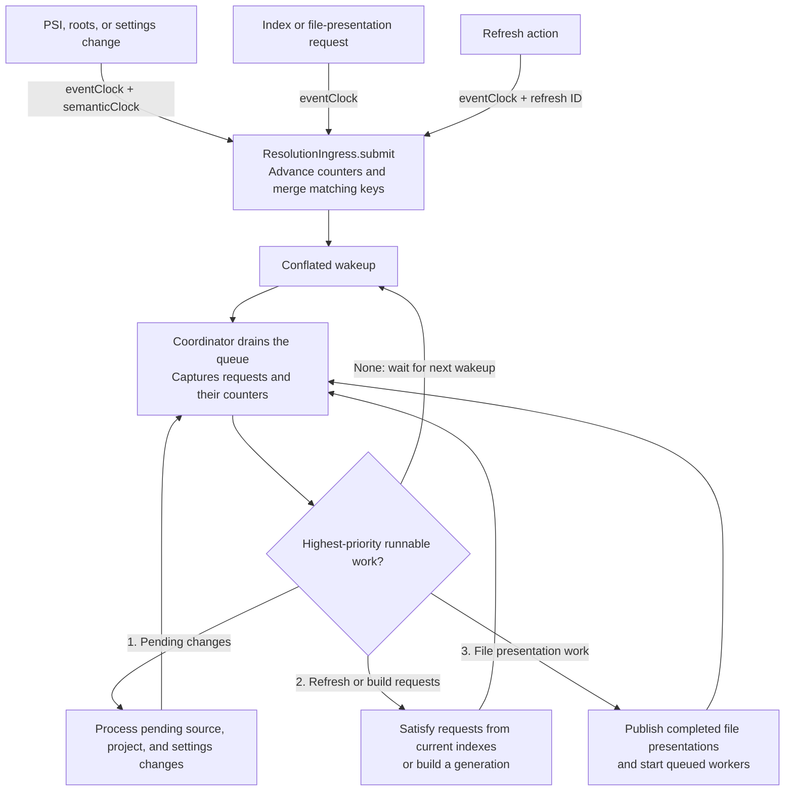
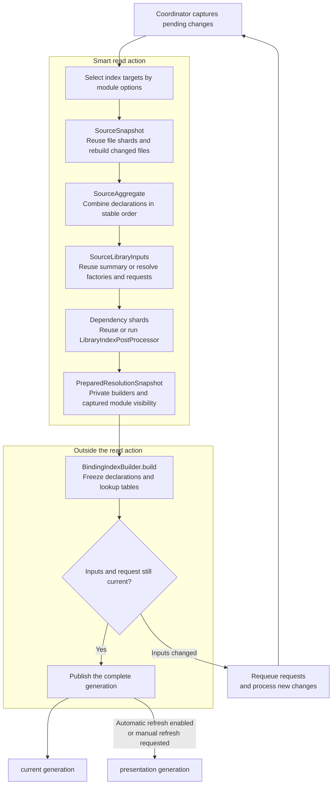
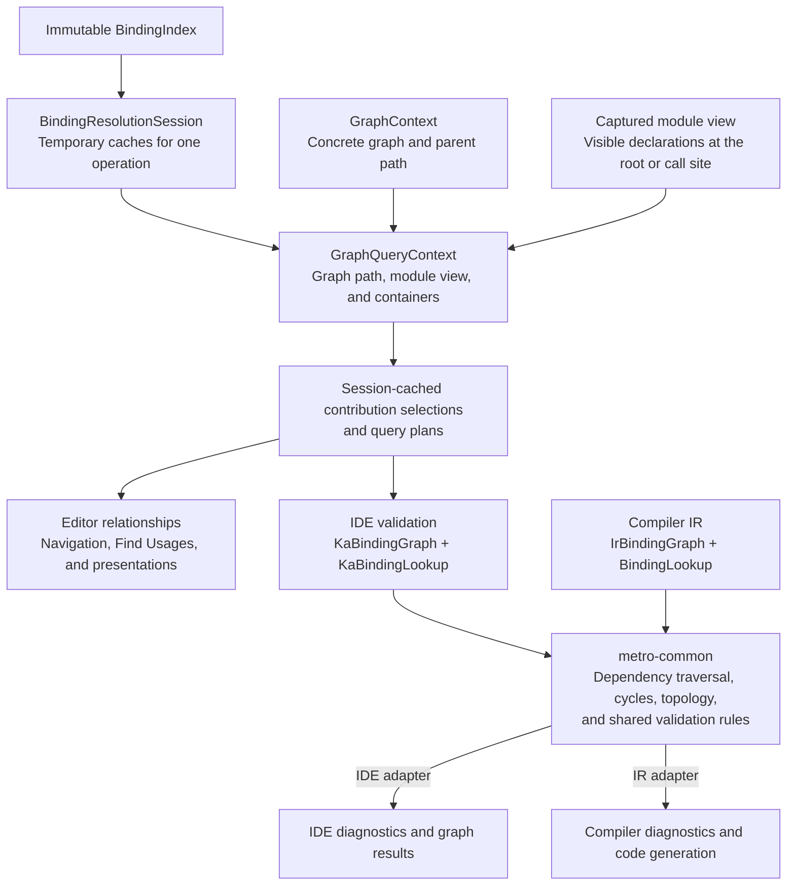

# How IDE binding resolution works

`MetroResolutionService` builds binding indexes in the background after source or project changes.
Editor features and actions such as Find Usages and validation query those indexes.

An index holds declarations and lookup tables. A generation groups indexes with the source and
project versions they describe. A session caches queries for one operation against an index.

## 1. Requests enter through one queue

IDE callbacks can arrive on different threads. `ResolutionIngress.submit()` updates counters and
merges requests with matching keys while holding the queue lock. The wakeup channel combines repeated
signals. Requests stay in the queue until the coordinator takes them with `drain()`.

The coordinator processes source changes, project inputs, settings, manual refresh, ordinary build
requests, and file presentations in that priority order. It checks new arrivals after each work item
and waits when no work can run. Draining moves requests into its pending state. It still needs to
classify the changes to decide what needs rebuilding.

A query for an untracked source file also queues a PSI event to inspect it. This advances the semantic
clock even if the file turns out to contain no Metro declarations.

File presentation workers compute gutter, code vision, and inlay data. They send results through
ingress so the coordinator can check the attempt and index before publishing. At most two presentation
or anchor-update workers run at once. Anchor updates refresh declaration locations while keeping the
existing binding results.

Code: [ResolutionIngress](../src/main/kotlin/dev/zacsweers/metro/idea/index/ResolutionIngress.kt),
[coordinator and publication](../src/main/kotlin/dev/zacsweers/metro/idea/index/MetroResolutionService.kt),
[file presentations](../src/main/kotlin/dev/zacsweers/metro/idea/index/FilePresentationBundle.kt).

### What the clocks and revisions mean

The ingress clocks count accepted requests. They start at zero and keep their values across drains.
Several submissions can merge into one queued event.

| Value | When it changes | Used for |
| --- | --- | --- |
| `eventClock` | Every accepted submission, including merged requests and worker completions. | Numbering submissions and assigning manual-refresh IDs. |
| `semanticClock` | An event may change bindings, such as a PSI, roots, or settings event. | Detecting new input during a build and changes awaiting classification. |
| `latestManualRequestId` | A manual refresh stores its `eventClock` here. Other events leave it unchanged. | Detecting a newer refresh that replaces the one being built. |
| `classifiedSemanticClock` | The coordinator finishes processing source, project, and settings changes through a captured ingress snapshot. | Recording how far classification has progressed. |
| `semanticRevision` | The coordinator invalidates binding data, including when checking a change fails. | Tracking the binding-data version. Irrelevant edits can leave it unchanged. |
| `IndexInputs.roots` / `compilerSettings` | IntelliJ's root or compiler-settings tracker advances. | Checking that the project inputs still match those used by the build. |
| `IndexGenerationToken` | Each build attempt creates an identity shared by its indexes. | Matching indexes and cached presentation results to a build attempt. |

Queries accept a generation as current when all three checks pass:

- Its `semanticRevision` matches `PublishedResolution.latestSemanticRevision`.
- `classifiedSemanticClock` matches ingress's `semanticClock`.
- Its `IndexInputs` match the current project trackers.

In manual mode, the browser shows a stale-data notice while classification is pending or
`latestSemanticRevision` is ahead of `graphBrowserRefreshRevision`. Compiler-setting changes that only
affect generated output can update `IndexInputs` while keeping the same indexes and generation token.

### An edit arrives during a build

Suppose a build starts at `eventClock = 40`, `semanticClock = 8`, and `semanticRevision = 5`:

| Step | Event clock | Semantic clock | Result |
| --- | --- | --- | --- |
| An editor requests a hint. | 41 | 8 | The existing build can continue. |
| A PSI change arrives. | 42 | 9 | The build's captured semantic clock is now behind. |
| Another PSI change arrives before the queue drains. | 43 | 10 | The PSI events merge. Both submissions still count. |
| The build checks its inputs. | 43 | 10 | It requeues its requests without publishing the indexes. |
| The coordinator drains and classifies the edits. | 43 | 10 | It records `classifiedSemanticClock = 10` once the pending changes are processed. |

If either edit affects bindings, the coordinator advances `semanticRevision` and rebuilds the affected
data. If both edits are irrelevant, the revision can stay at `5` and a published index can become
current again. If a canceled read action aborts the build, its requests are requeued. Disposing the
service stops its work and cancels waiting requests.

## 2. Build a complete generation, then publish it

Modules with the same compiler-option fingerprint and library-resolution setting share an index.
Each such group is an index target. `ResolutionSnapshotBuilder` prepares one builder per target inside
the coordinator's smart read action. It reads PSI and the Kotlin Analysis API there, and records module
visibility and source identities for later queries.

A source scan finds files and collects their declarations into `FileShard`s. Incremental builds
replace affected shards, including shards that depend on changed files, and share unchanged data.
Aggregation attaches graph interfaces and associates shared factory inputs with every owning graph.
Source factories are resolved before collecting library requests. When library resolution is disabled,
dependency shards are empty.

`PreparedResolutionSnapshot` holds the mutable builders until `buildIndexes()` freezes them outside the
read action. Before publishing, the coordinator checks for newer events that may change bindings,
changed project inputs, and cancellation. A manual-refresh build also checks for a newer refresh request.
Every target must have a complete index. The coordinator clears the invalidations handled by that build
only after publication.

| Reused data | Owner and lifetime |
| --- | --- |
| Per-file `FileShard` | Cached on the source file with its dependency stamps and force-rebuild tracker. |
| Source snapshot maps and shard order | Shared across incremental snapshots where unchanged. |
| Source/library summary | Kept in `SourceSnapshot` while library inputs and source-module ownership remain unchanged. |
| Dependency shards | `ResolutionSnapshotBuilder` keeps up to eight in an LRU cache and removes entries when roots or module options change. |
| Published indexes | Kept by `MetroResolutionService` and readers using those generations. |

Code: [snapshot builder](../src/main/kotlin/dev/zacsweers/metro/idea/index/snapshot/ResolutionSnapshotBuilder.kt),
[source snapshot](../src/main/kotlin/dev/zacsweers/metro/idea/index/snapshot/SourceSnapshot.kt),
[aggregation](../src/main/kotlin/dev/zacsweers/metro/idea/index/snapshot/SourceAggregate.kt),
[library inputs](../src/main/kotlin/dev/zacsweers/metro/idea/index/snapshot/SourceLibraryInputs.kt),
[library-input comparisons](../src/main/kotlin/dev/zacsweers/metro/idea/index/snapshot/SourceLibrarySignatures.kt),
[prepared snapshot](../src/main/kotlin/dev/zacsweers/metro/idea/index/snapshot/PreparedResolutionSnapshot.kt),
[index builder](../src/main/kotlin/dev/zacsweers/metro/idea/model/BindingIndexBuilder.kt).

### Why `current` and `presentation` can differ

Validation, Find Usages, and graph debug export use `current`. The graph browser and editor decorations
use `presentation`. Automatic refresh normally updates both. In manual mode, an action can build a new
`current` generation while `presentation` stays unchanged.

For example, start with both pointing to generation A and disable automatic refresh. Change a provider,
then run validation. Validation builds and queries generation B. The browser and decorations still
show A, with a stale-data notice in the browser. Clicking Refresh builds a generation with the pending
changes and updates both references. Decoration positions can keep moving with their declarations
while the displayed binding data stays at A.

On the EDT, queries for current data return a current cached result or schedule a build and return
empty. Manual presentation and cache-only reads return cached data without scheduling a build.
Background callers can wait for current data. They release any read action before waiting so the
coordinator can acquire its own smart read action.

Code: [request policy](../src/main/kotlin/dev/zacsweers/metro/idea/index/IndexRequestPolicy.kt),
[generation selection and refresh](../src/main/kotlin/dev/zacsweers/metro/idea/index/MetroResolutionService.kt).

## 3. Query an index, then resolve a graph when needed

`BindingIndex` contains immutable declarations, lookup tables, and module views. Each operation uses
a `BindingResolutionSession` to cache graph contexts, contribution selections, and query plans. A
session has one caller at a time and is discarded when the operation finishes. Separate operations
can read the same index concurrently.

The graph path determines the scopes, contributions, exclusions, containers, and parent bindings used
by the query. The module view determines which declarations are visible from the root graph or dynamic
call site. An extension can have several parent paths, so a query needs the path as well as the
declaration. When the index has no graphs, consumer queries fall back to bindings visible from the
consumer's module.

Graph-specific editor queries filter out bindings with incompatible scopes. Validation keeps them so it
can report the conflict. A validation run can reuse one session per index across several graphs. For
each graph, `KaBindingGraph` calls the shared graph code to follow dependencies and validate them.
`KaBindingLookup` supplies bindings along the way.

The IDE and compiler use their own types, binding lookups, and diagnostic reporting. Both call
`MutableBindingGraph.seal()` and the validation rules in `metro-common`. The IDE also uses shared
contribution rules such as `computeMergePlan`. Request scheduling, captured module visibility,
navigation pointers, and editor updates live in `idea-plugin`.

Code: [binding index](../src/main/kotlin/dev/zacsweers/metro/idea/model/BindingIndex.kt),
[resolution session](../src/main/kotlin/dev/zacsweers/metro/idea/model/BindingResolutionSession.kt),
[IDE graph adapter](../src/main/kotlin/dev/zacsweers/metro/idea/graph/KaBindingGraph.kt),
[IDE lookup adapter](../src/main/kotlin/dev/zacsweers/metro/idea/graph/KaBindingLookup.kt),
[validation runs](../src/main/kotlin/dev/zacsweers/metro/idea/graph/MetroGraphValidationService.kt),
[compiler graph adapter](../../compiler/src/main/kotlin/dev/zacsweers/metro/compiler/ir/graph/IrBindingGraph.kt),
[shared graph traversal](../../metro-common/src/main/kotlin/dev/zacsweers/metro/compiler/graph/BindingGraph.kt),
[shared validation](../../metro-common/src/main/kotlin/dev/zacsweers/metro/compiler/graph/BindingGraphValidator.kt).
